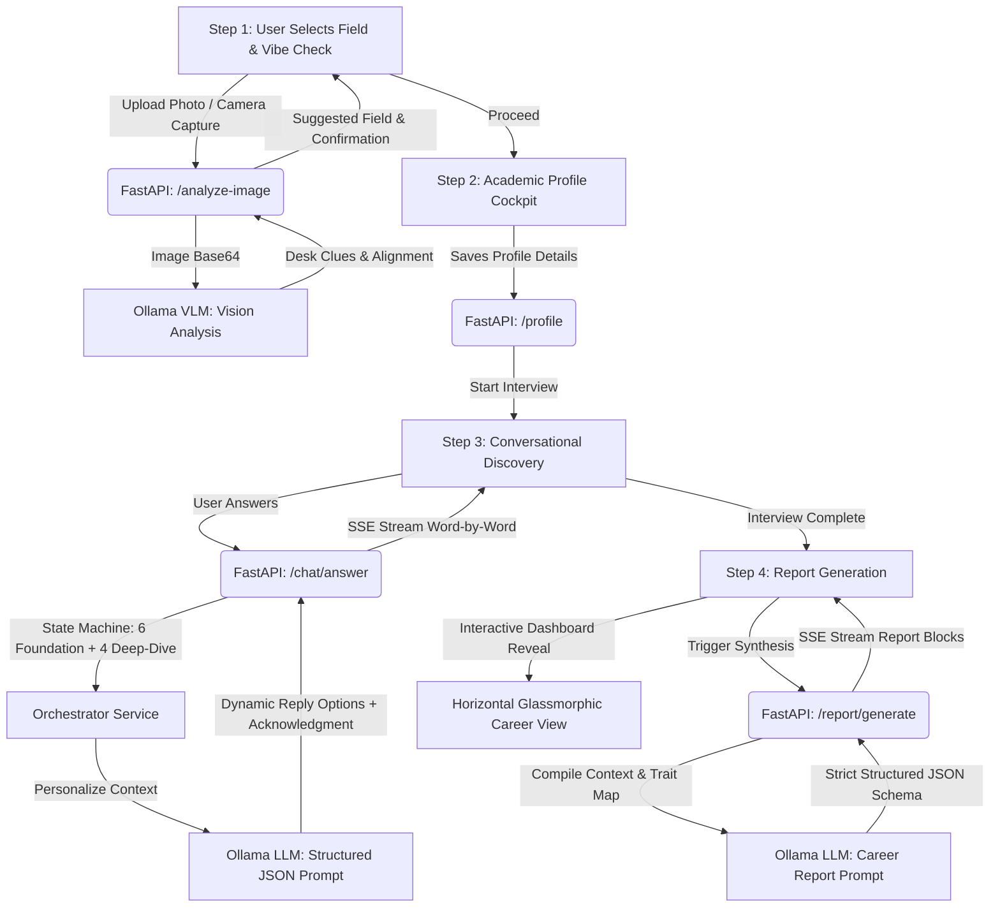

# Poppy Career Counselor: System Architecture & AI Blueprint

This document provides a highly detailed, professional architectural blueprint and functional analysis of the **Poppy Career Counselor** web platform. It walks through the end-to-end technical components, detailed visual designs, async state machines, multimodal vision engines, and advanced local LLM generation systems that power Poppy.

---

## 🗺️ High-Level System Workflow

The following system chart represents the end-to-end user data flow across the Poppy Career Counselor ecosystem:



---

## 🎨 1. Visual Frontend Architecture (Next.js, TS, Tailwind, Framer Motion)

The frontend is a cinematic, state-of-the-art Single Page Application built on **Next.js 14**, utilizing **TypeScript**, **TailwindCSS**, and **Framer Motion** to deliver a responsive cockpit-style command deck.

### 🌌 Immersive Starry Backdrop & Butter-Smooth FPS Isolation
* **Lightweight Global Drift:** The background rendering system generates 35 slow-drifting, glowing stars overlayed by double-pulsing soft nebulas (`bg-indigo-500/[0.03]` and `bg-purple-500/[0.03]`).
* **FPS Isolation Optimization:** High-fidelity Framer Motion animations and dynamic SVG tracks can cause significant calculations. To guarantee a locked **60FPS** on Step 4's visual reports, the global particle hook conditionally checks `currentStep !== 4`. As soon as the user enters the report dashboard, the starry drift shuts down, garbage collecting background DOM calculations and yielding full browser rendering power to the report panels.

### 🛠️ Horizontal Cockpit Profile Card Stack (Step 2)
To avoid generic, tall, scroll-heavy layouts, Step 2 is structured into **4 horizontal dashboard module cards** spanning a wide screen layout (`max-w-7xl` / 1280px):
1. **Academic Foundation:** Features a streamlined, 3-column row containing Class 10%, Class 12%, and Stream selectors.
2. **Context & Environment:** Handles Current Education level, Target Entrance Exams, Geography/Region, and a dynamic Languages input array.
3. **Interests & Activities:** Utilizes a highly flexible grid featuring scrollable subject selectors and dynamic tag inputs for hobbies and extracurricular activities.
4. **Mindset & Blueprint:** Features custom interactive toggle buttons mapping Work Style Preferences, Career Values, and Career Worries.

### 📐 Decoupled Custom Slider Tracks (`slider.tsx`)
Standard browser range inputs suffer from rendering offsets because browsers calculate relative track heights dynamically. To solve this:
* The native `<input type="range">` track styling is set to `bg-transparent` (fully invisible).
* Sibling `div` layers represent the inactive bar (`h-1 bg-white/10`) and active bar (`h-1 bg-gradient-to-r from-indigo-500 to-purple-500`).
* These layers are absolute-positioned, perfectly centered on the horizontal axis (`top-1/2 -translate-y-1/2`), and sit directly behind the transparent native slider range, aligning the progress line and glowing thumb without vertical offsets.

---

## ⚡ 2. Async Backend Architecture (FastAPI & Session Storage)

The backend is built using **FastAPI**, fully leveraging Python's asynchronous async/await concurrency paradigms to handle multiple streaming LLM requests concurrently.

```
backend/
├── config.py           # System settings, host, and model parameters
├── main.py             # FastAPI App initialization & CORS configurations
├── sessions_db.json    # Lightweight persistent session storage database
├── routers/
│   ├── chat.py         # Multi-phase interactive dialogue endpoints
│   ├── image_analysis.py# Multimodal VLM vision analysis router
│   ├── profile.py      # Profile initialization and metadata
│   ├── report.py       # Career report synthesis and history handlers
│   ├── session.py      # Session lifecycle initiator
│   └── vibe.py         # Sandbox vibe routing
└── services/
    ├── ollama_client.py# Async HTTP client wrappers for Ollama APIs
    ├── orchestrator.py # Multi-phase interview state machine rules
    ├── prompt_manager.py# Dynamic Markdown template engine loader
    └── session_store.py# IO serialization, state schemas, and database handlers
```

### 💾 Persistent Session Store (`session_store.py`)
Session states are managed locally inside a persistent schema:
* **SessionState Schema:** Tracks the user's `session_id`, current visual steps, selected field, user metadata, dynamic chat logs, structural diagnostic models, and generated reports.
* **UserModel Schema:** Stores diagnostic trait dimensions parsed during the chat (`motivation`, `lifestyle_preferences`, `role_models`, `concerns`, `work_environment`, `values_priority`, `aspiration`).
* **JSON Serialization:** To prevent database memory locks, every state modification automatically flushes clean JSON strings to `sessions_db.json` asynchronously.

---

## 🤖 3. Core AI Technologies & Multimodal Models

The Poppy brain is driven by a local LLM execution framework utilizing **Ollama** as the model runner.

### 👁️ Multimodal Visual Desk Clues Analyzer (VLM Engine)
Step 1 allows the user to upload a photo of their workspace, desk, or textbook setup. This image is handled via a **VLM (Vision-Language Model)**:
1. **Multimodal API Request:** The image is converted into a base64 encoded string and submitted inside a message payload to Ollama's vision capabilities (specifically the active **`gemma4:e2b`** model).
2. **Visual Observation Clues:** The VLM analyzes the image for specific educational objects (e.g. medical textbooks, calculators, electronics, art pads, journals, notebooks).
3. **Structured Image Response Prompt:**
   * The VLM is prompted with `IMAGE_ANALYSIS_PROMPT` to analyze study desks, books, laptops, art tools, sports gear, etc., and confirm if they align.
   * Enforces strict, zero-text JSON schema generation:
     ```json
     {
       "suggested_field": "TECH & AI",
       "confidence": 0.85,
       "reasoning": "Observed dual monitors showing IDE code alongside an engineering textbook.",
       "secondary_suggestions": ["SCIENCES"],
       "should_pursue": true,
       "pursue_decision": "STRONGLY RECOMMEND",
       "pursue_explanation": "The workspace items directly reflect a solid dedication to coding and analytical sciences."
     }
     ```
4. **Normalized Mapping Routing:** The returned field suggestion is routed through an backend mapping module (`normalize_field()`), translating variations (e.g., "coding", "computers") into standard domains (*TECH & AI*, *MEDICINE*, *CREATIVE ARTS*, *COMMERCE*, *LAW & POLICY*, *SCIENCES*).

### 💬 State-Governed Career Discovery Machine (`orchestrator.py`)
The counseling interview does not use generic, unstructured chatting. Instead, the `Orchestrator` governs a strict, **10-question diagnostics state machine**:

#### Phase A: Foundation (Questions 0 - 5)
* **Q0 (Motivation):** Personalization based on selected field.
* **Q1 (Academic mapping):** Contextualized with the favorite subjects dynamically extracted from the Step 2 profile.
* **Q2 (Extracurricular):** Injects specific hobbies and school activities reported in the profile.
* **Q3 (Lifestyle):** Injects selected work style preferences (e.g., desk-bound vs. remote vs. outdoors).
* **Q4 (Role models):** Explores professional inspirations.
* **Q5 (Concerns):** Personalizes questions addressing their reported "Biggest Career Worry" (e.g. High Competition, Wrong Path Fear).

#### Phase B: Deep Dive (Questions 6 - 9)
* **Q6 (Path Matching):** Leverages initial traits to pitch a hybrid career combination (e.g. product management vs tech-policy blend).
* **Q7 (Work Environment):** Pinpoints physical preferences.
* **Q8 (Values & Priorities):** Balances salaries vs job satisfaction vs work-life balance using the custom values entered during Step 2.
* **Q9 (Aspirations):** Explores risk-free career desires.

### 📝 Dynamic Prompt Rendering & Options Synthesis
The dialogue system leverages specialized template files stored inside `backend/prompts/`:

* **`chat_json.md` Prompt:**
  Prompted with strict system instructions, it guides the local LLM to output a precise JSON blueprint containing:
  1. An `acknowledgment` string: Empathizes warmly and validates the user's prior response.
  2. An `options` array: Renders **exactly 3 custom quick-reply emojis and choices** customized precisely to the upcoming question.
* **JSON Syntax Robustness & Double-Quote Escape Safety:**
  The system strips potential Markdown formatting blocks (` ```json ` wrapper) and parses content via standard `json.loads`. To prevent JSON parsing crashes caused by LLMs using unescaped quotes inside keys (like `"acknowledgment": "That is "cool"!"`), a custom regex parser dynamically captures key-value attributes and replaces unescaped nested double quotes with safe single quotes (`'`) before executing JSON decoders.

---

## 🌊 4. SSE Streaming & Token-Level Emulation

To maximize perceived responsiveness, the backend implements a customized **SSE (Server-Sent Events) pipeline** to stream content back to the client interface.

```
User Answered ➜ API Called ➜ orchestrator.get_current_question()
                                             │
      ┌──────────────────────────────────────┴──────────────────────────────────────┐
      ▼                                                                             ▼
[LLM Dynamic Options Call]                                                [Dynamic Question Selected]
 Ollama generates dynamic                                                  Orchestrator personalization
 JSON containing:                                                                   │
  • "acknowledgment"                                                                │
  • "options"                                                                       │
      │                                                                             │
      └──────────────────────────────────────┬──────────────────────────────────────┘
                                             ▼
                          [Concatenated Acknowledgment + Question]
                                             │
                                  [SSE Stream Tokenizer]
                          Text split into space-delimited words
                                             │
                            Word-by-word yield loop with sleep
                             (asyncio.sleep(0.035) interval)
                                             │
                                             ▼
                             [Smooth Typing Effect in UI]
```

1. **Structured Synthesis:** The system triggers an async API call to Ollama to generate the structured acknowledgment and chips.
2. **Merging Logic:** Once parsed, the `acknowledgment` text is concatenated with the orchestrator's personalized core `question`.
3. **Word-by-Word Streaming:** The unified sentence is split into space-delimited words. The backend yields the token strings incrementally inside a streaming generator with a tight **`35ms` delay** (`asyncio.sleep(0.035)`).
4. **Dynamic Option Payload:** At the end of the streaming loop, the backend yields the fully formatted `options` array, prompting the React client to cleanly animate the custom quick-reply chips onto the screen.

---

## 📊 5. Comprehensive Visual Report Synthesis (`report_generation.md`)

Once the interview completes (`PHASE_SYNTHESIS`), the system pulls all 10 answers and the accumulated personality profile into a massive synthetic prompt:

* **Strict JSON Synthesis:** Generates a structured profile outlining the top 3 optimal paths:
  ```json
  {
    "top_3_paths": [
      {
        "rank": 1,
        "title": "Path Title",
        "fit_score": 95,
        "why": "Deep analytical description",
        "roadmap": [
          { "phase": "Now (College)", "steps": ["Step 1", "Step 2"] },
          { "phase": "Graduation", "steps": ["Step 1", "Step 2"] },
          { "phase": "5-Year Vision", "steps": ["Step 1"] }
        ],
        "indian_context": {
          "exams": ["GATE", "CAT"],
          "target_companies": ["TCS", "Infosys"],
          "avg_salary_range": "₹X-Y LPA"
        }
      }
    ],
    "summary": "Holistic review",
    "disclaimer": "AI counselor warning"
  }
  ```
* **Fit Score Engine:** Calculates a 0-100 score mapping.
* **3-Tiered Roadmap:** Generates actionable, localized milestones spanning the immediate, near-term, and long-term horizons.
* **Indian Context Integration:** Explicitly maps real competitive exams (e.g. GATE, CAT, UPSC, NEET, GRE), real target domestic and multinational corporations (e.g. Google India, Razorpay, CRED, Jio AI Labs), and realistic local starting and senior salary tiers (Lakhs Per Annum).
